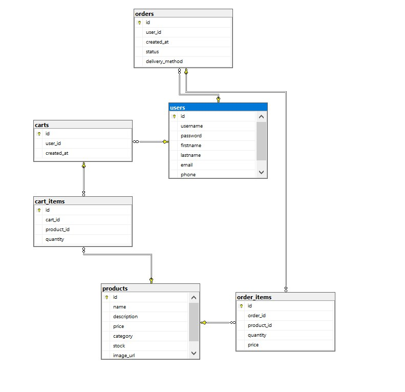

# задание 1
<h1 align = "center">Wi-Fi</h1>

<h2 align = "center"></h2>
Wi-Fi — технология беспроводной локальной сети с устройствами на основе стандартов IEEE 802.11. Под аббревиатурой Wi-Fi (от английского словосочетания Wireless Fidelity, которое дословно переводится как «беспроводная верность» в настоящее время развивается целое семейство стандартов передачи цифровых потоков данных по радиоканалам. 
Wi-Fi был создан в 1997 году инженером Джоном О'Салливаном в лаборатории радиоастрономии CSIRO (Commonwealth Scientific and Industrial Research Organization) в Австралии.
Также в его изобретении огромную роль сыграла голливудская кинозвезда Хеди Ламарр. Она придумала принцип беспроводной передачи информации.
Благодаря технологии Wi-fi интернет становится мобильным и различные устройства могут получить доступ к интернету.

# задание 2

# задание 3

 

# задание 4

 
 
 
 

